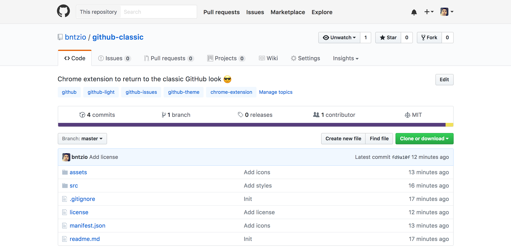

<h1 align="center">GitHub Classic</h1>

Chrome extension to return to the classic GitHub look 😎

### Features

* Super light-weight (only 71KB) 😄
* Instantly get the classic GitHub look (white header) 🏳️
* Always updating! 🙌
* No user permissions needed! 🎉

### Screenshot

