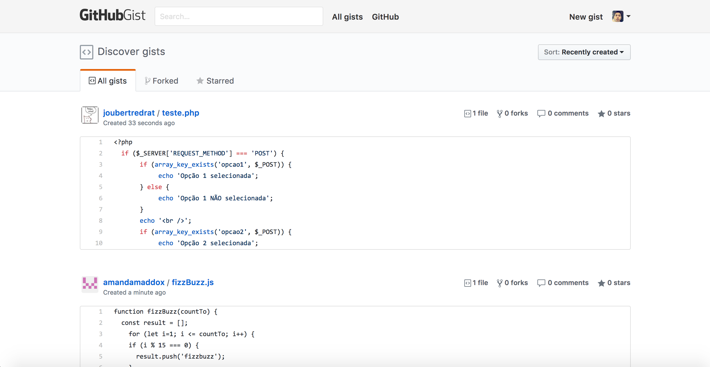

<h1 align="center">GitHub Classic</h1>

Chrome extension to return to the classic GitHub look 😎

### Features

* Super light-weight (only 21KB!) 🙌
* Instantly get the classic GitHub look (white header) 🔳
* Always updating! 🎉

### Screenshots

